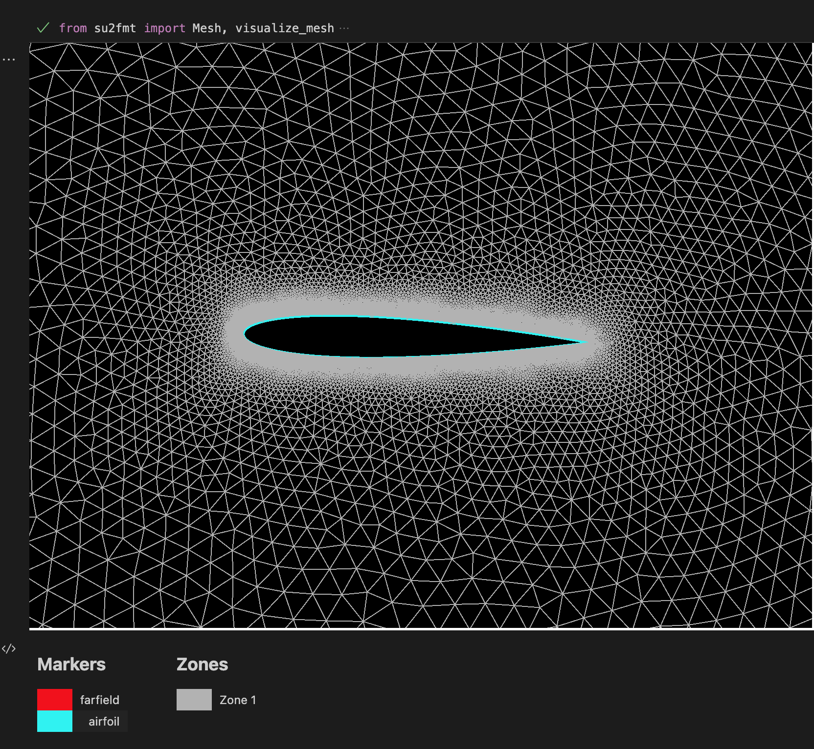

<h1 align="center">🕸️ su2fmt</h1>

<p align="center">the open source SU2 mesh format parser and visualizer</p>

<p align="center">
    <a href="https://discord.gg/H7qRauGkQ6">
        
    </a>
    <a href="https://www.patreon.com/turbodesigner">
        
    </a>
</p>


# About
su2fmt parses and visualizes the SU2 mesh format in accordance with the spec here:
https://su2code.github.io/docs/Mesh-File/. Currently the visualizer works in Jupyter Notebooks using pythreejs.


# Install
```
pip install git+https://github.com/Turbodesigner/su2fmt.git#egg=su2fmt
```

# Example
See more examples in the [examples](/examples) directory

```python
from su2fmt import parse_mesh, generate_mesh

# parses mesh file
mesh = parse_mesh("example.su2")

# generate mesh file
generate_mesh(mesh, "example_generated.su2")
```
#### Note: `visualize_mesh` has been moved to [ezmesh](https://github.com/Turbodesigner/ezmesh)





# Devlopement Setup
```
git clone https://github.com/Turbodesigner/su2fmt.git
cd su2fmt
pip install -r requirements_dev.txt
```
